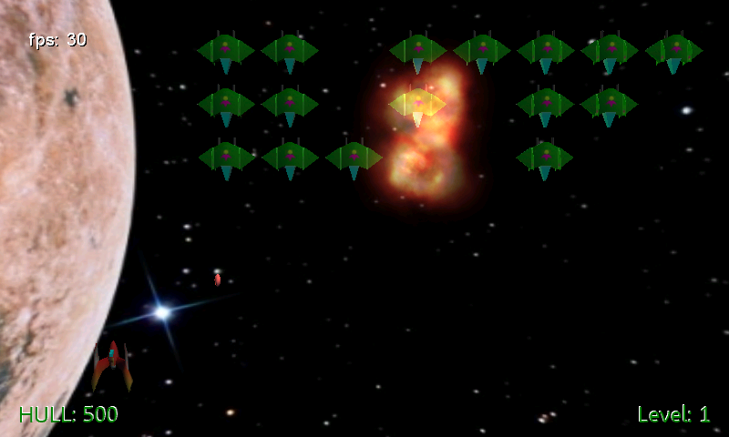

# KosmicWarz-WP
From my archives, Kosmic Warz is a 3D shooter inspired by Space Invaders, build in C# &amp; XNA 4.0 for the Windows Phone 7.5 Silverlight platform.

## Project History
This 3D shooter evolved from XNA demos I built back in 2007 when I was teaching XNA development at various user groups, code camps and other conferences & events. The code was ported a few times from XNA 1.0 to XNA 4.0 and then adapted for mobile on the Windows Phone 7.0 & 7.5 platform.

The game was originally known under several names:
* Space Invaders 3D
* Space Invaders Extreme
* Infinite Invaders
* Brash Pilot
* Kosmic Warz

I've never gotten around to releasing it in any store, as it was mainly a learning tool for me. My goal is to eventually port it to MonoGame for cross-platform release, and I also intend to rebuild a similar concept in Unity. It's an old codebase but includes some good ideas - like the first-person shooter mode - and the accelerometer-based controls are exceptionally smooth and responsive. I wanted to re-share the source again since the days of my old XNAMentor.com site.

## Follow Me
* Twitter: [@ActiveNick](http://twitter.com/ActiveNick)
* Blog: [AgeofMobility.com](http://AgeofMobility.com)
* SlideShare: [http://www.slideshare.net/ActiveNick](http://www.slideshare.net/ActiveNick)
